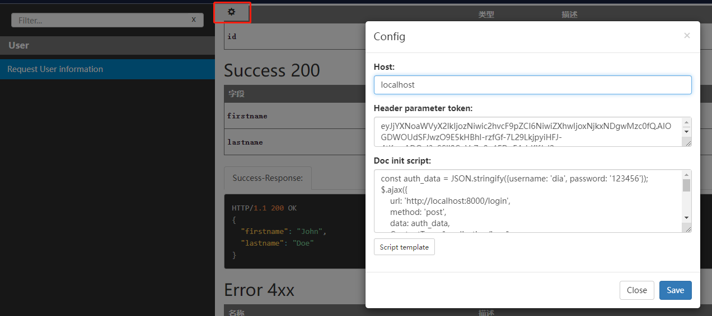

# apidoc-template
Add config panel to modify request host and header params.




```javascript
const auth_data = JSON.stringify({username: 'jackson', password: '123456'});
// request auth info.
$.ajax({
    url: 'http://localhost/login',
    method: 'post',
    data: auth_data,
    ContentType: "application/json",
    type: 'json',
    dataType: 'json',
    success(resp) {
        if (resp.errcode === 0) {
            $('input[data-name="token"]').val(resp.data.token);
            docInitCallbackFunc(); //  * Need to keep!!!
        }
    }
});`
```